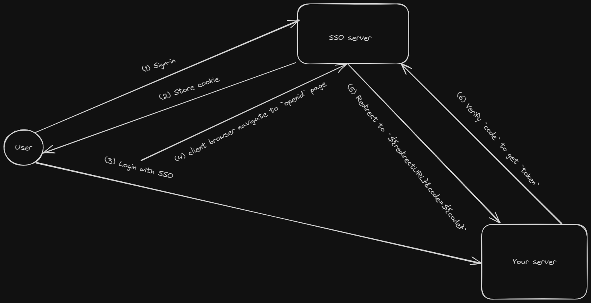

# simple-sso

# Desciption

This is a project for demonstrating a very simple SSO server with OpenId mechanism. This project is inspired by Slack Authentication which my company is applying for controlling authentication function.

# OpenID flow



#

I just make a simple system for demonstrating SSO server, in real implementation, there are many more things to do.

I simplified the `sign-in` and `sign-on` functions.

# SSO server: sso.js

First of all, you need to `register` on SSO server by calling

```
curl --location 'http://localhost:3000/reg' \
--header 'Content-Type: application/json' \
--data '{
    "organization": "Org1"
}'
```

and receive `clientId` of your organization and `token` for your account on SSO.

Then use this `token` to log into SSO system by go to browser and access

```
http://localhost:3000/login?token=yyy
```

This route simply store a cookie on your machine to mark that you logged in.

# 3rd-party server: demo.js

Access the index page at `http://localhost:4000/`

Client on `Login with SSO`

And you will see you are logged in.
